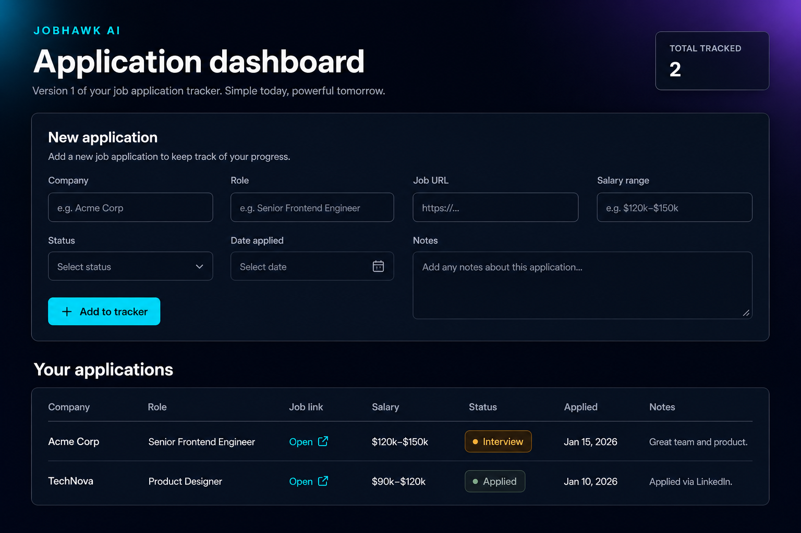

# Zodiac Sign Finder

A **desktop zodiac & element finder** built with Python and Tkinter — refactored from a school-era CLI script into a portfolio-ready GUI with tests and an optional Windows `.exe`.


<!-- Portfolio: replace with your screenshot after adding docs/screenshots/dashboard.png -->


> **Portfolio:** Add your own screenshots under [`docs/screenshots/`](docs/screenshots/README.md), then update the image path above. See [`PORTFOLIO.md`](PORTFOLIO.md) for LinkedIn copy.

## Highlights

- **Live preview** — sign updates as you change month or day (slider + spinner)
- **Professional UI** — sidebar inputs, large result panel, element badges, status bar
- **Solid logic** — Western tropical zodiac boundaries, input validation, 16 unit tests
- **Offline & private** — no network, no database, no accounts
- **Shippable** — `build.ps1` produces `ZodiacSignFinder.exe` via PyInstaller

## Features

- Month dropdown and day controls with per-month max days
- Zodiac symbol, sign period, and element personality text
- Element legend (Fire / Earth / Air / Water)
- Copy result to clipboard (`Ctrl+C`)
- Menu bar (File, Help)

## Screenshots (for your portfolio)

| | |
|---|---|
| Place your captures in `docs/screenshots/` | See [screenshot guide](docs/screenshots/README.md) |

Recommended files: `dashboard.png`, `form.png`

## Run locally

```powershell
git clone https://github.com/YOUR_USERNAME/zodiac-sign-finder.git
cd zodiac-sign-finder
python main.py
```

Requirements: **Python 3.10+** with **tkinter** ([python.org](https://www.python.org/)).

```powershell
python -m zodiac_gui
python -m unittest discover -s tests -v
```

## Build Windows `.exe`

```powershell
.\build.ps1
```

Output: `dist\ZodiacSignFinder.exe` — ideal for a GitHub **Release** asset (do not commit `dist/`).

## Project structure

```
zodiac-sign-finder/
├── zodiac_gui/              # Application package
│   ├── app.py               # Tkinter GUI
│   ├── zodiac_logic.py      # Sign lookup & validation
│   └── theme.py
├── tests/
├── docs/screenshots/        # Portfolio images (you add PNGs here)
├── main.py
├── build.ps1
├── PORTFOLIO.md             # LinkedIn / resume blurbs
└── README.md
```

## Security & privacy

- No network access
- Birth date stays in memory only while the app runs
- See [SECURITY.md](SECURITY.md)

## Connect this repo to GitHub

```powershell
cd zodiac-sign-finder
git init
git add .
git status
git commit -m "Initial release: Zodiac Sign Finder v2"
git branch -M main
git remote add origin https://github.com/YOUR_USERNAME/zodiac-sign-finder.git
git push -u origin main
```

Use an **empty** new repo on GitHub (no README) so you do not get merge conflicts.

### Before you push

- [ ] `git status` shows **no** `build/`, `dist/`, or `__pycache__/`
- [ ] Screenshots added under `docs/screenshots/` (optional but great for portfolio)
- [ ] Replace `YOUR_USERNAME` in this README and `pyproject.toml`

## Keyboard shortcuts

| Key | Action |
|-----|--------|
| `Enter` | Calculate / refresh |
| `Ctrl+C` | Copy result |
| `Alt+F4` | Exit |

## License

MIT — see [LICENSE](LICENSE).
