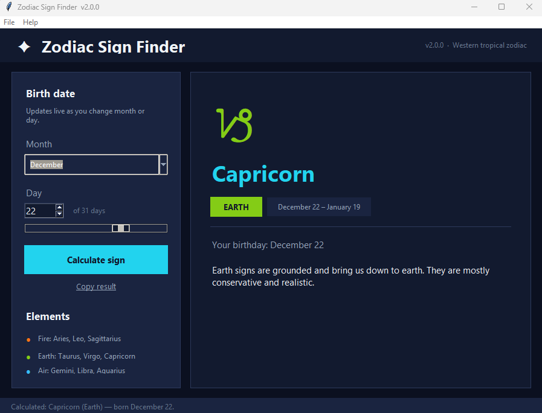

# Zodiac Sign Finder

Desktop application for **Western tropical zodiac** signs and elements from a birth month and day. Built with **Python 3** and **Tkinter**.




## Overview

Zodiac Sign Finder validates birth dates, maps them to the correct sign using standard tropical zodiac date boundaries, and presents the sign symbol, element, date range, and a short element description. The interface updates live as the user changes month or day.

## Features

- Live preview while adjusting month and day (dropdown, spinner, slider)
- Result panel with zodiac symbol, element badge, and sign date range
- Sidebar element reference (Fire, Earth, Air, Water)
- Input validation (per-month day limits, required fields)
- Copy formatted result to clipboard
- Optional Windows executable via PyInstaller

## Requirements

- Python **3.10+**
- **tkinter** (included with the standard Python installer on Windows)

## Installation

```bash
git clone https://github.com/Camerenjackson/zodiac-sign-finder.git
cd zodiac-sign-finder
```

## Usage

```bash
python main.py
```

Or run as a module:

```bash
python -m zodiac_gui
```

### Keyboard shortcuts

| Key | Action |
|-----|--------|
| `Enter` | Calculate / refresh |
| `Ctrl+C` | Copy result |
| `Alt+F4` | Exit |

## Tests

```bash
python -m unittest discover -s tests -v
```

## Build (Windows executable)

```powershell
.\build.ps1
```

Produces `dist\ZodiacSignFinder.exe`. Build artifacts are not committed to the repository; publish binaries via [GitHub Releases](https://docs.github.com/en/repositories/releasing-projects-on-github/managing-releases-in-a-repository) if desired.

## Project structure

```
zodiac-sign-finder/
├── zodiac_gui/
│   ├── app.py            # Tkinter application
│   ├── zodiac_logic.py   # Sign lookup and validation
│   └── theme.py          # UI tokens
├── tests/
│   └── test_zodiac_logic.py
├── docs/screenshots/
├── main.py
├── build.ps1
└── pyproject.toml
```

## Privacy

The application does not use the network and does not persist birth dates to disk. Data exists only in memory for the duration of the session. See [SECURITY.md](SECURITY.md) for more detail.

## License

MIT — see [LICENSE](LICENSE).
